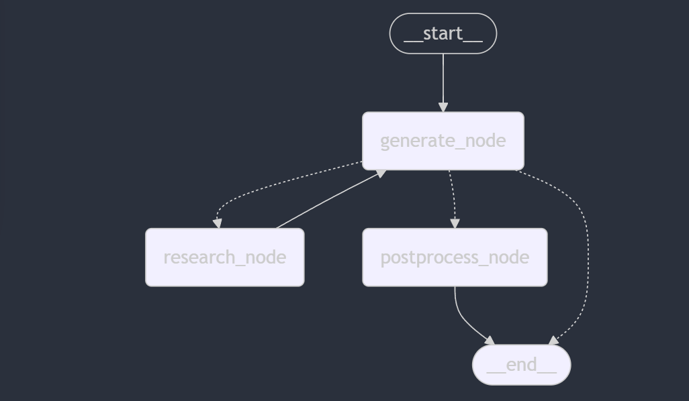

# AIE5_Midterm

Location of docs:
https://journals.lww.com/iopt/fulltext/2018/50040/effect_of_hand_splinting_versus_stretching.5.aspx

Homework location:
https://www.notion.so/Session-11-Midterm-189cd547af3d800d8407f74826756268#189cd547af3d81c2b2fbc0573761ab21

 What specific therapeutic activities and exercises have been shown to be most effective in resolving symptoms and treating chronic tennis elbow for adults between the ages of 30-50 years old according to peer reviewed journal articles published in the last 5 years? 

break out like this:
Research indicates several therapeutic activities and exercises effective for treating chronic tennis elbow (lateral epicondylitis) in adults aged 30-50. Here are the most commonly supported interventions based on evidence from peer-reviewed studies published in the last five years:

1. **Eccentric Exercises**: Eccentric strengthening exercises targeting the wrist extensors have been shown to effectively reduce pain and improve function.

2. **Isometric Exercises**: Isometric exercises can help build strength in the forearm muscles without increasing pain, making them suitable for acute phases of recovery.

3. **Stretching**: Gentle stretching of the wrist extensors improves flexibility and alleviates tension, contributing to pain relief.

4. **Manual Therapy**: Soft tissue mobilization and joint mobilization techniques may enhance outcomes, especially when combined with exercise.

5. **Ultrasound Therapy**: While research on therapeutic ultrasound shows mixed results, some studies support its use alongside exercise therapy for symptom relief.

6. **Taping and Bracing**: Kinesiology tape or forearm braces can provide support, reducing strain during activities and allowing for better engagement in therapeutic exercises.

7. **Functional Activities**: Gradual return to specific functional tasks, customized to the individual's daily activities, can improve physical readiness and psychological well-being.

Combining these interventions in a comprehensive treatment plan, tailored to the individual's specific condition and needs, is crucial for effective management of chronic tennis elbow. Always consider consulting the latest literature or a healthcare professional for updated strategies.

powershell commands:
- create a git repo in github have the creator add the python git ignore file
- uv init src_midterm
- cd src_midterm
- del hello.py
- uv add uuid7 nest_asyncio langchain_core langgraph langchain-text-splitters langchain_community langchain-qdrant langchain_openai    
- Open vs code . code no longer works since we installed the other IDE (Cursor)
- Let vsCode control the git

---
`possible work flow:`

---
## Task 1: 

**Problem Statement:**  
Occupational therapists often need quick access to reliable, up-to-date information on splinting techniques and tools while working with patients, but the time-consuming process of manually searching for articles and images can disrupt patient care.

**Why this is a Problem:**  
Occupational therapists, like my wife, are often pressed for time during patient sessions and need immediate access to accurate and relevant information. Manually searching through journal articles and Google for splinting techniques or images is inefficient and detracts from valuable patient interaction. A chatbot capable of quickly retrieving and displaying OT splinting information, including images or at least direct links to source articles, would streamline this process. This solution would enhance clinical efficiency, support evidence-based practice, and ultimately improve patient outcomes by allowing the therapist to focus more on hands-on care rather than administrative tasks.

## Task 2:
Proposed Solution:

This solution will provide an intuitive chatbot interface that allows the occupational therapist to quickly ask questions about splinting techniques, retrieve relevant journal articles, and view images directly within the chat (if possible). The chatbot will streamline the search process by automatically querying reliable sources and returning the most pertinent results, ensuring that the therapist can focus on patient care.

Tooling Choices:

a. `LLM` – OpenAI's GPT-4o model will be used initially for its state-of-the-art performance in natural language understanding and generation. While the assignment may require fine-tuning a model later, GPT-4o-mini provides a solid proof of concept due to its reliability and ease of integration.

b. `Embedding Model` – OpenAI's embedding model will be used to generate embeddings for text and images, ensuring semantic search capabilities across both modalities.

c. `Orchestration` – LangGraph will be utilized for its graph-based orchestration, allowing for flexible and maintainable workflows when managing multiple retrieval and processing steps.

d. `Vector Database` – Qdrant will serve as the vector database because it supports multimodal storage, making it ideal for storing both image embeddings and PDF embeddings separately while allowing for efficient combination during retrieval.

e. `Monitoring` – LangSmith will be used for monitoring, as it provides detailed tracking, debugging, and visualization of LLM application workflows, ensuring that the system runs smoothly and any issues can be quickly identified and resolved.

f. `Evaluation` – RAGAS will be employed for evaluation, particularly for assessing the quality of responses in a RAG (Retrieval-Augmented Generation) system. This tool is appropriate as it offers metrics for measuring the relevance and accuracy of retrieved and generated content.

g. User Interface – The user interface is yet to be determined, as it depends on the feasibility of displaying images within the chat interface. One potential suggestion is using a simple web-based UI built with Streamlit for rapid prototyping and easy integration with the backend, providing a clean and responsive interface for querying and displaying results.

## Task 3:
You are an AI Systems Engineer.  The AI Solutions Engineer has handed off the plan to you.  Now you must identify some source data that you can use for your application.  
Deliverables

1. `Data Sources and External APIs:`

    - Tavily Search API with Google Integration: This will be used to perform top-k searches from Google, retrieving the most relevant and up-to-date splinting information, research articles, and best practices from the web.
    - Indian Journal of Occupational Therapy (IJOT): This source will provide peer-reviewed articles and research papers on OT splinting techniques, ensuring high-quality and reliable data for the chatbot.

2. `Default Chunking Strategy:` 
    - RecursiveCharacterTextSplitter with chunk_size = 500 and chunk_overlap = 0: This method is chosen because it is commonly used in class projects for its simplicity and effectiveness in maintaining coherent text segments. This strategy ensures that text chunks are small enough for processing by the LLM while minimizing redundant overlap.  
    
    `However we will most likely be looking into either:`
    - Paragraph-based Chunking: This approach could be more suitable for preserving the logical flow of information, especially in academic articles, ensuring that related concepts are kept together within the same chunk.
    - Semantic Chunking: Using embeddings to split text based on semantic similarity could help improve the accuracy of retrieved information by keeping related topics within the same chunk.

## Task 4: 

`Prototype:` This will be addressed in the code and other sections of this README file.

---
### Random thoughts for the project.

Code Breakdown:  
We plan to create a folder to store some of our PDFs and possibly images. For our midterm, we will experiment with a multimodal vector store.
Might have a flag that can be set that will invoke RAGAS on the pipeline.  Wondering how this might play out with hugging face env thought.. might have to setup a chatbot interface and try or can it just init my main.py and I can see? not sure.. prez not sure.

Change directions. maybe we want to take the top 5 results then have the LLM pick the top one that is the most related read the page push it to the vector store.  However, we will want to check the vector store to see if the data is already there.  so might need SQL to do this to keep a list of the links that we already pulled?
---